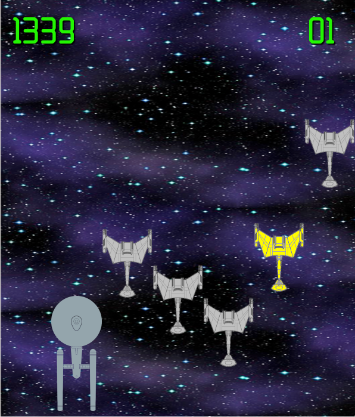
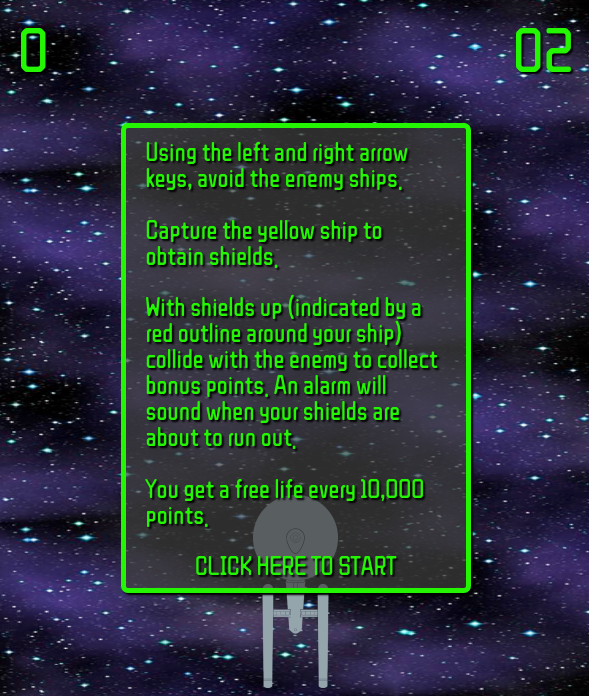

# Star Trek: An Object Oriented Programming Game Project

## The game

This game is called **Star Trek**. Not very imaginative, but it will do. The object of the
game is to pilot the Starship Enterprise to avoid colliding with the Klingon D7 Class Battle
Cruisers.

## Instructions

The intro screen details how to play the game:

## Modifications

Several modifications were made to the original game:

1. Fixed the collision detection.
2. Changed the images to reflect the game's Star Trek theme.
3. Added an explosion sequence when the player collides with the enemy.
4. Added a score board.
5. Added multiple lives.
6. Added a shields concept when a special enemy is captured to get bonus points.
7. A free life is awarded every n points.
8. Modified the supplied Text.js code to place text within the game.
9. Created an intro screen to describe how to play the game.
10. Added back ground music and sound effects.
11. Additional parameters are configurable via data.js like free lives, how often shields are
offered, how long shields last, bonus points and collision sensitivity.
12. Configured the game board with increased width and number of enemies.

### To play the game, follow this link:

https://musing-nobel-0edd9a.netlify.app

